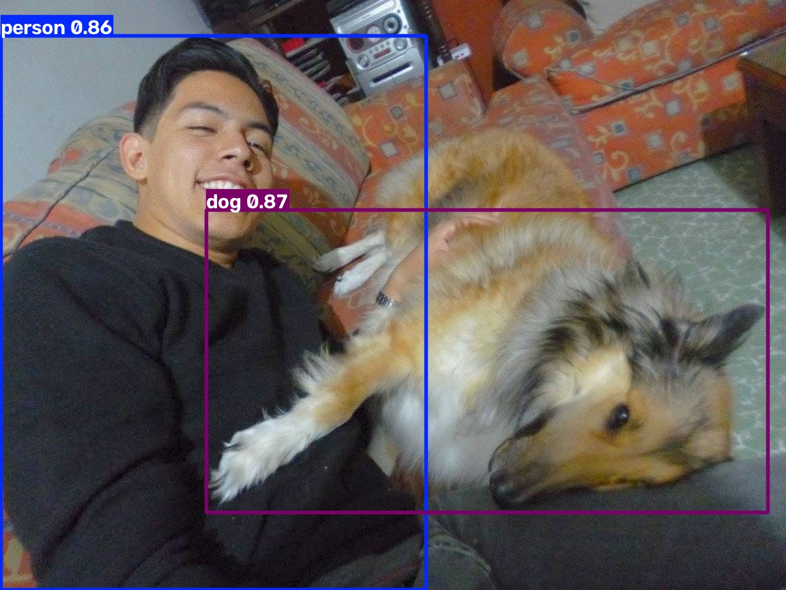

<!-- # Vision Pipeline -->

**🚧 Active Development**  
The project is part of the AI Engineering Portfolio and focuses on clean software architecture, modular inference backends and reproducible deployment ([Back to the Portfolio Hub](https://edavila-drraccoon.github.io/portfolio_site/)). 

## Quick Start
---

```bash
git clone https://github.com/eDavila-DrRaccoon/vision_pipeline.git
cd vision_pipeline
docker compose up --build
```

The project will:

- download the YOLO11 model (first run only)
- perform inference
- save the annotated image

## Features | Current capabilities:
---

- Modular package architecture
- Docker-first execution
- YAML-based configuration
- CLI inference
- Application logging
- YOLO11 object detection

## Pipeline
---

    Image
    ↓
    Loader
    ↓
    Preprocessor
    ↓
    YOLO11
    ↓
    Postprocessor
    ↓
    Result

## Architecture
---
For additional architectural decisions see:  
[Architecture (MD)](./docs/architecture.md)

## Demo
---


*Figure: Inference result by using `YOLO11m`.*

## Project Status
---

- ✅ Docker
- ✅ YOLO11
- ✅ CLI inference
- ⬜ FastAPI
- ⬜ TensorRT
- ⬜ ONNX Runtime

## Contact me
---

- **Author:** Eduardo de Jesús Dávila Meza, Ph.D.
- **LinkedIn:** [EduardoDavilaMeza](https://www.linkedin.com/in/eduardodavilameza/)
- **GitHub**: [eDavila-DrRaccoon](https://github.com/eDavila-DrRaccoon)