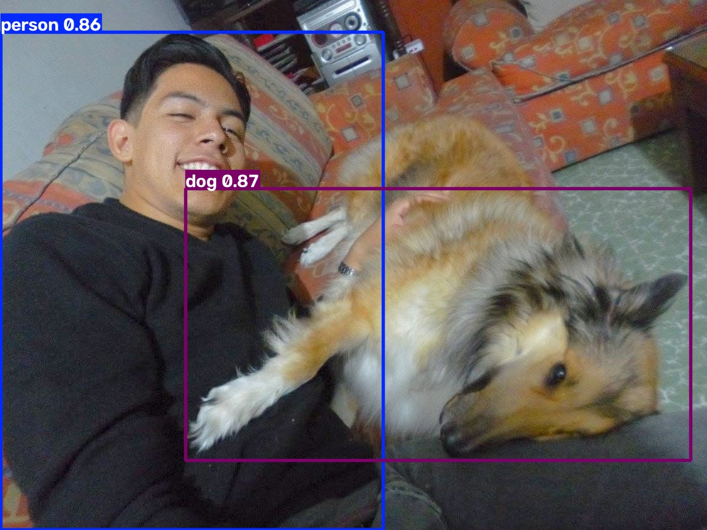

<!-- 
Title and description included in `_config.yml`

# Vision Pipeline

Production-oriented Computer Vision inference framework featuring FastAPI, Docker, YOLO11, YAML configuration and modular architecture. --> 

Production-oriented Computer Vision Inference Framework.

Vision Pipeline is a modular FastAPI-based framework designed to simplify the development and deployment of computer vision inference services as maintainable software products. Rather than focusing on model development, it emphasizes software engineering by combining reproducible Docker environments, YAML-based configuration, REST APIs, structured logging, and a YOLO11 inference pipeline within a clean and extensible architecture, with planned support for multiple inference backends including PyTorch, ONNX Runtime, and TensorRT. 

The project demonstrates how modern AI inference systems can be engineered as **modular, reproducible, and production-ready software products**.

**🚧 Active Development**  
The project is part of the AI Engineering Portfolio and focuses on clean software architecture, modular inference backends and reproducible deployment ([Back to the Portfolio Hub](https://edavila-drraccoon.github.io/portfolio_site/)). 

## 1. Technology Stack & Features
---

| Category | Technology / Feature |
|:--------:|:--------------------:|
| Architecture | Modular package architecture |
| Language | Python 3.13 |
| Packaging | `pyproject.toml` |
| Deployment | Docker + Docker Compose |
| REST API | FastAPI |
| API Documentation | OpenAPI / Swagger UI |
| Input Methods | JSON paths + multipart/form-data uploads |
| API Contract | OpenAPI 3.x |
| Configuration | YAML |
| Response Format | Uniform JSON contract |
| Error Handling | Global exception handler |
| Logging | Python logging |
| CLI | Command-line interface |
| Deep Learning | PyTorch |
| Model | YOLO11 object detection |
| Benchmarking | Automated benchmark reports |
| Report Export | JSON + CSV |


## 2. Prerequisites
---

Before running Vision Pipeline, make sure you have installed:

- Docker Engine 28+
- Docker Compose v2+
- Git

Verify your installation:
```bash
docker --version
docker compose version
git --version
```

## 3. Quick Start
---

```bash
git clone https://github.com/eDavila-DrRaccoon/vision_pipeline.git
cd vision_pipeline
docker compose up --build
```

Once the application is running, the API will be available at [http://localhost:8000/](http://localhost:8000/), whereas the Interactive API documentation (Swagger UI) and OpenAPI specification will be available at [http://localhost:8000/docs](http://localhost:8000/docs).

On the first execution, the application will:

- build the Docker image
- start the FastAPI service
- download the YOLO11 model automatically (first request only)
- perform object detection after an inference request
- save the annotated image to the configured output directory (default: `outputs/predict/`)

## 4. FastAPI REST API (JSON + multipart/form-data)
---

Once the service is running, open:
```text
http://localhost:8000/docs
```

FastAPI automatically exposes an interactive Swagger UI and generates an OpenAPI specification. The Swagger UI allows every endpoint to be explored and tested directly from the browser, whereas the API contract can also be exported as a standalone JSON document for integration with external tools.

The OpenAPI specification can also be exported as a standalone file:

```bash
python scripts/export_openapi.py
```

The generated specification is stored in:

```text
docs/openapi.json
```

This file represents the REST contract of the application and can be consumed by API clients, SDK generators, testing tools and external documentation platforms.

Vision Pipeline provides two inference endpoints to support different integration scenarios:

| Endpoint | Input | Intended use |
| :------: | :---: | :----------: |
| `POST /inference/path` | JSON body | Local development, automated testing and benchmarking |
| `POST /inference/upload` | `multipart/form-data` | Web applications, mobile clients and third-party services |


### 4.1 Path-based Inference Endpoint

#### Example using Swagger UI

Once the service is running, open:

```text
http://localhost:8000/docs#/Inference/inference_inference_path_post
```

Select the **POST** `/inference/path` endpoint, provide the path to a supported image file (JPG, JPEG, PNG, BMP, TIFF or WEBP) that is accessible from the Vision Pipeline workspace (*e.g.*, `examples/images/dog_and_person.jpg`) and execute the request directly from the browser.

#### Request body
```json
{
  "image": "string"
}
```

#### Example request:
```json
{
  "image": "examples/images/dog_and_person.jpg"
}
```

#### Example using curl
```bash
curl -X 'POST' \
  'http://127.0.0.1:8000/inference/path' \
  -H 'accept: application/json' \
  -H 'Content-Type: application/json' \
  -d '{
  "image": "examples/images/dog_and_person.jpg"
}'
```
#### Example response:
```json
{
  "status": "success",
  "message": "Inference completed successfully.",
  "data": {
    "output_directory": "outputs/predict/dog_and_person.jpg"
  }
}
```

### 4.2 Upload and Inference Endpoint

Vision Pipeline also supports direct image uploads using `multipart/form-data`, allowing client applications to upload images directly without requiring prior access to the server filesystem.

This endpoint is intended for integration with web applications, mobile clients and third-party services where images are uploaded directly by users.

This endpoint accepts an uploaded image, stores it temporarily, executes the inference pipeline and returns the same JSON response schema as the path-based inference endpoint.

#### Example using Swagger UI

Once the service is running, open:

```text
http://localhost:8000/docs#/Inference/inference_upload_inference_upload_post
```

Select the **POST** `/inference/upload` endpoint, choose a supported image (JPG, JPEG, PNG, BMP, TIFF or WEBP) from your local machine (*e.g.*, `dog_and_person.jpg`) and execute the request directly from the browser.

#### Example using curl
```bash
curl -X 'POST' \
  'http://localhost:8000/inference/upload' \
  -H 'accept: application/json' \
  -H 'Content-Type: multipart/form-data' \
  -F 'image=@examples/images/dog_and_person.jpg;type=image/jpeg'
```

#### Example response:
```json
{
  "status": "success",
  "message": "Inference completed successfully.",
  "data": {
    "output_directory": "outputs/predict/dog_and_person_20260803_214740.jpg"
  }
}
```

### 4.3 HTTP Status Codes

Both inference endpoints share the same HTTP status codes.

| Code | Description |
|:----:|:-----------:|
| 200 | Request completed successfully |
| 400 | Invalid request payload |
| 404 | Requested image not found |
| 500 | Internal server error |

#### Example error
```json
{
    "status": "error",
    "message": "Image not found: examples/images/dog_an_person.jpg",
    "data": null
}
```

## 5. Pipeline
---

```
   Image
     ↓
   Loader
     ↓
Preprocessor
     ↓
   YOLO11
     ↓
Postprocessor
     ↓
   Result
```

## 6. Architecture
---

```
        Vision Pipeline
              │
  ┌───────────┴─────────────┐
  │                         │
 CLI                    REST API
  │                         │
  └───────────┬─────────────┘
              │
     Inference Service
              │
            YOLO11
```

## 7. Project Documentation
---

| Document | Description |
|:--------:|:-----------:|
| [`docs/architecture.md`](./docs/architecture.md) | System architecture, design decisions and project roadmap. |
| [`docs/benchmark.md`](./docs/benchmark.md) | Benchmark methodology, reproducible performance measurements and benchmark reports. |
| [`docs/openapi.md`](./docs/openapi.md) | OpenAPI specification, export process and integration use cases. |

## 8. Benchmarking
---

Vision Pipeline includes a reproducible benchmarking infrastructure for measuring end-to-end inference performance.

Run the benchmark:

```bash
python scripts/benchmark.py
```

Benchmark reports are stored under `reports/benchmarks/` in both JSON and CSV formats.

Each execution automatically:

- performs a warm-up inference;
- measures average latency and throughput (FPS);
- reports memory consumption;
- exports a timestamped JSON report;
- appends the results to a benchmark history CSV.

## 9. Demo
---


*Figure: Object detection performed by Vision Pipeline using `YOLO11m`.*

## 10. Project Status
---

- ✅ REST API (JSON + multipart/form-data)
- ✅ Swagger UI
- ✅ OpenAPI specification export (`openapi.json`)
- ✅ Dockerized environment
- ✅ YOLO11 inference
- ✅ YAML configuration
- ✅ Application logging
- ✅ CLI interface
- ✅ Modular project architecture
- ✅ Benchmarking infrastructure
- ⬜ ONNX Runtime backend
- ⬜ TensorRT backend

## 11. Continuous Integration
---

Vision Pipeline uses **GitHub Actions** to automatically validate the project on every push and pull request targeting the `main` branch.

The continuous integration workflow currently performs the following tasks:

- checks out the repository;
- installs the required system libraries used by the inference pipeline;
- installs the project dependencies;
- installs the project in editable mode;
- executes the complete unit test suite using `pytest`.

The CI environment is intentionally aligned with the project's Docker environment to ensure consistent dependency resolution and reproducible test execution across local development, containerized deployments and GitHub Actions.

This automated validation helps prevent regressions and ensures that new contributions do not break existing functionality.

Future workflow stages will include:

- code formatting verification (`black`);
- import ordering (`isort`);
- static analysis (`ruff`);
- Docker image build validation;
- multi-version Python testing.

## 12. Contact me
---

- **Project Author:** Eduardo de Jesús Dávila Meza, Ph.D.
- **LinkedIn:** [EduardoDavilaMeza](https://www.linkedin.com/in/eduardodavilameza/)
- **GitHub**: [eDavila-DrRaccoon](https://github.com/eDavila-DrRaccoon)