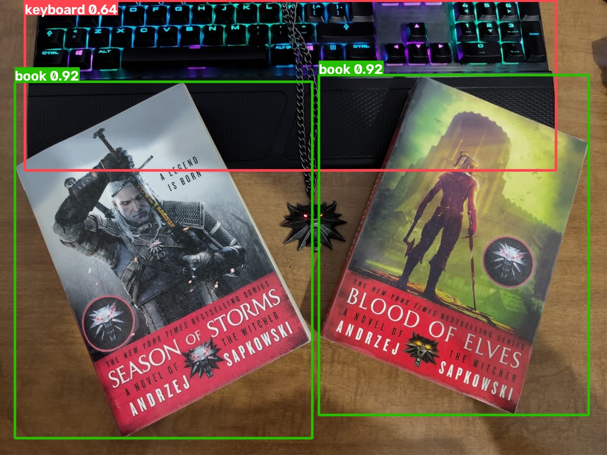

# Benchmark v1

## Objective
---

This document establishes the initial performance baseline of Vision Pipeline using the current PyTorch inference backend and the YOLO11m model.

The collected metrics will serve as a reference for future comparisons against optimized inference backends such as ONNX Runtime and TensorRT.

## Test Configuration
---

| Parameter | Value |
|-----------|-------|
| Backend | PyTorch |
| Model | YOLO11m |
| Device | CPU |
| Model size | 38.80 MB |
| Iterations | 10 |
| Warm-up | 1 iteration (excluded from results) |
| Input image | `examples/images/books.jpg` |

## Hardware
---

| Component | Value |
|-----------|-------|
| CPU | Intel® Core™ i7-9700K @ 4.90 GHz |
| RAM | 64 GB DDR4 |
| GPU | NVIDIA GeForce RTX 3070 LHR *(not used in this benchmark)* |
| Operating System | Ubuntu 26.04 LTS (Resolute Raccoon) |
| Python | 3.14 |

## Methodology
---

The benchmark measures the **end-to-end execution time** of the Vision Pipeline inference function.

Each iteration performs the following operations:

```
  Input image
       ↓
 Image validation
       ↓
 YOLO11 inference
       ↓
Results generation
       ↓
 Return to caller
```

To obtain more representative measurements:

- the YOLO model is loaded only once before benchmarking;
- one warm-up inference is executed before collecting measurements;
- prediction image export is disabled;
- the average execution time is computed over ten consecutive iterations.

Unlike the internal timing reported by Ultralytics, this benchmark measures the total execution time perceived by the application.

## Results
---

| Metric | Value |
|---------|------:|
| Average inference time | **132 ms** |
| Throughput | **7.55 FPS** |
| RAM usage | **938.22 MB** |
| Model size | **38.80 MB** |

Example output:

```text
========== Benchmark Results ==========
Device            : cpu
Model             : yolo11m.pt
Average inference : 0.132 s
FPS               : 7.55
RAM Usage         : 938.22 MB
Model Size        : 38.80 MB
```

## Benchmark Script
---

The benchmark can be executed with:

```bash
python scripts/benchmark.py
```

The script automatically:

- loads the configured model;
- performs one warm-up inference;
- executes multiple benchmark iterations;
- computes the average inference time;
- estimates throughput (FPS);
- reports memory usage and model size.

## Benchmark Image
---


*Figure: Benchmark image processed using the PyTorch backend and `YOLO11m`.*

## Current Limitations
---

This first benchmark intentionally focuses on establishing a reproducible baseline.

Current limitations include:

- CPU execution only;
- single-image inference;
- batch size of one;
- no GPU measurements;
- no peak memory tracking;
- no latency distribution (minimum, maximum or standard deviation).

These aspects will be incorporated in future benchmarking iterations as additional inference backends are implemented.

## Future Work
---

Future benchmark versions will compare:

- PyTorch vs ONNX Runtime;
- PyTorch vs TensorRT;
- CPU vs GPU execution;
- latency distribution;
- memory consumption;
- throughput under batch inference;
- multiple YOLO model sizes (n, s, m, l and x).

---

[Back to the Main Page](https://edavila-drraccoon.github.io/vision_pipeline/)